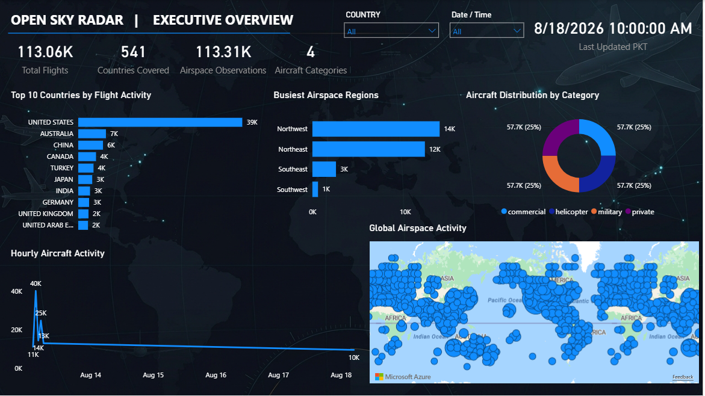

# ✈️ OpenSky Radar — End-to-End Data Engineering Pipeline

<div align="center">

### Real-Time Aircraft Data Ingestion, Transformation & Analytics

An end-to-end cloud data engineering project that ingests aircraft tracking data from the OpenSky Network API, processes it through AWS and Snowflake, orchestrates the workflow with Apache Airflow, and delivers analytical insights through Power BI.

<br>



</div>

---

## 📌 Project Overview

The **OpenSky Radar Pipeline** is an end-to-end Data Engineering project designed to demonstrate how raw aviation data can be collected, stored, transformed, validated, and converted into business-ready analytical datasets.

The pipeline automatically:

- Extracts aircraft tracking data from the **OpenSky Network API**
- Stores raw data in **Amazon S3**
- Loads data into **Snowflake**
- Processes data through **Bronze → Silver → Gold** layers
- Performs automated **data quality checks**
- Generates analytical datasets for reporting
- Orchestrates the complete workflow using **Apache Airflow**
- Provides the final analytical data to **Power BI**

The pipeline is scheduled to run **hourly**.

---

# 🏗️ System Architecture

<div align="center">


</div>

### Architecture Flow

```text
OpenSky Network API
        │
        ▼
Python Data Extraction
        │
        ▼
Amazon S3
        │
        ▼
Snowflake — Bronze
        │
        ▼
Snowflake — Silver
        │
        ▼
Snowflake — Gold
        │
        ├──────────────► Data Quality Checks
        │
        ▼
     Power BI
```

---

# 🔄 Data Pipeline

The complete pipeline is orchestrated using **Apache Airflow**.

## 1. Data Extraction

A Python extraction script connects to the OpenSky Network API and retrieves aircraft state information.

The extracted data includes attributes such as:

- ICAO24
- Callsign
- Origin Country
- Longitude
- Latitude
- Barometric Altitude
- Velocity
- True Track
- Vertical Rate
- Squawk
- Aircraft Registration
- Aircraft Model
- Aircraft Type
- Aircraft Category
- Transport Kind
- Last Seen
- Last Contact
- Ingestion Timestamp

---

## 2. Cloud Storage — Amazon S3

After extraction, the data is written to a CSV file and uploaded to **Amazon S3**.

S3 acts as the cloud-based raw storage layer before the data enters the warehouse.

```text
OpenSky API
     ↓
Python
     ↓
CSV
     ↓
Amazon S3
```

---

## 3. Bronze Layer — Raw Data

The raw data is loaded from S3 into the **Bronze layer** of Snowflake.

The Bronze layer preserves the incoming data before applying major transformations.

```text
Amazon S3
    ↓
Snowflake BRONZE
```

---

## 4. Silver Layer — Cleaned Data

The Silver layer transforms the raw dataset into a cleaner and more standardized format.

Transformations include:

- Data type standardization
- Timestamp handling
- Null handling
- Column normalization
- Invalid value handling
- Aircraft data cleaning
- Coordinate validation

The result is a structured dataset ready for analytical processing.

```text
BRONZE
   ↓
Cleaning & Transformation
   ↓
SILVER
```

---

# 🥇 Gold Layer — Analytical Data

The Gold layer contains business-ready datasets designed specifically for analytics and reporting.

## ✈️ Aircraft Category Statistics

**Table:**

```text
AIRCRAFT_CATEGORY_STATS
```

Provides aircraft statistics grouped by category.

Metrics include:

- Aircraft Count
- Average Altitude
- Average Velocity
- Average Vertical Rate

---

## 🌍 Flights Per Country Per Hour

**Table:**

```text
FLIGHTS_PER_COUNTRY_HOUR
```

Aggregates flight activity by:

- Origin Country
- Flight Hour
- Flight Count

Example:

| Origin Country | Flight Count |
|---|---:|
| United States | 39,108 |
| Australia | 6,603 |
| China | 5,904 |
| Canada | 4,239 |
| Turkey | 3,644 |

---

## 🗺️ Busiest Airspace Regions

**Table:**

```text
BUSIEST_AIRSPACE_REGIONS
```

Aircraft are categorized into four geographical regions:

- Northeast
- Northwest
- Southeast
- Southwest

Metrics include:

- Aircraft Count
- Average Altitude
- Average Velocity

---

## 📡 Airspace Activity

**Table:**

```text
AIRSPACE_ACTIVITY
```

Provides aggregated aircraft activity data for geographical and operational analysis.

---

# ❄️ Snowflake Data Warehouse

The Snowflake warehouse follows a **Medallion Architecture**:

```text
OPENSKY_DB
│
├── BRONZE
│   └── Raw aircraft data
│
├── SILVER
│   └── Cleaned & standardized aircraft data
│
└── GOLD
    ├── AIRCRAFT_CATEGORY_STATS
    ├── AIRSPACE_ACTIVITY
    ├── BUSIEST_AIRSPACE_REGIONS
    └── FLIGHTS_PER_COUNTRY_HOUR
```

This separation allows raw, transformed, and analytical data to be managed independently.

---

# ⚙️ Apache Airflow Orchestration

The complete workflow is managed by an Airflow DAG:

```text
opensky_pipeline
```

### Pipeline Dependencies

```text
Extract OpenSky
       ↓
Upload to S3
       ↓
Load Snowflake Bronze
       ↓
Transform Silver
       ↓
┌───────────────┬──────────────────┬─────────────────────┬──────────────────┐
│               │                  │                     │
▼               ▼                  ▼                     ▼
Flights Per   Aircraft         Airspace Activity    Busiest Airspace
Country Hour  Category Stats                         Regions
│               │                  │                     │
└───────────────┴──────────────────┴─────────────────────┘
                         │
                         ▼
                Data Quality Checks
```

### Scheduling

The DAG is configured for:

```text
Schedule: Hourly
Catchup: Disabled
```

This allows the pipeline to continuously ingest new aircraft data without processing historical missed schedules.

---

# ✅ Data Quality

Data quality checks are integrated directly into the Airflow workflow.

The pipeline validates:

### Raw Data

- Data availability
- Required records
- Basic data integrity

### Silver Data

- Cleaned data validity
- Required fields
- Valid transformations

### Gold Data

- Analytical table integrity
- Expected output
- Aggregated data validation

### Duplicate Detection

Checks for duplicate aircraft records.

### Coordinate Validation

Validates latitude and longitude values to identify invalid geographic coordinates.

---

# 🚨 Failure Monitoring

The Airflow pipeline includes automated failure notifications.

If a task fails, an email notification is generated containing:

- DAG name
- Failed task
- Execution time
- Airflow task log link

This makes pipeline failures easier to identify and troubleshoot.

---

# 📊 Power BI Dashboard

<div align="center">


</div>

The Gold-layer datasets are consumed by Power BI to create an analytical dashboard.

### Dashboard Insights

The dashboard provides insights into:

- ✈️ Aircraft activity
- 🌍 Flights by origin country
- 📡 Airspace activity
- 🛩️ Aircraft category statistics
- 📈 Flight activity over time
- 🗺️ Busiest airspace regions

Power BI is used as the **business intelligence and visualization layer**, while the data engineering pipeline remains responsible for ingestion, transformation, storage, orchestration, and validation.

---

# 🛠️ Technology Stack

| Technology | Role |
|---|---|
| **Python** | API ingestion and data processing |
| **OpenSky Network API** | Aircraft tracking data source |
| **Amazon S3** | Cloud object storage |
| **Amazon EC2** | Cloud compute environment |
| **Apache Airflow** | Workflow orchestration |
| **Docker** | Containerization |
| **Snowflake** | Cloud data warehouse |
| **SQL** | Data transformation & analytics |
| **Power BI** | Visualization & reporting |
| **Git** | Version control |
| **GitHub** | Source code management |

---

# 🐳 Dockerized Environment

Apache Airflow is deployed using Docker containers on an Amazon EC2 instance.

The environment includes:

- Airflow API Server
- Airflow Scheduler
- Airflow Worker
- Airflow DAG Processor
- Airflow Triggerer
- PostgreSQL
- Redis

Docker provides an isolated and reproducible environment for the orchestration layer.

---

# 📁 Project Structure

```text
opensky-radar-pipeline/
│
├── dags/
│   └── opensky_pipeline.py
│
├── scripts/
│   ├── __init__.py
│   ├── data_quality_check.py
│   ├── extract_opensky.py
│   └── upload_to_s3.py
│
├── sql/
│   │
│   ├── bronze/
│   │   └── load_bronze.sql
│   │
│   ├── silver/
│   │   └── transform_silver.sql
│   │
│   ├── gold/
│   │   ├── aircraft_category_stats.sql
│   │   ├── airspace_activity.sql
│   │   ├── busiest_airspace_regions.sql
│   │   └── flights_per_country_hour.sql
│   │
│   └── quality/
│       ├── check_coordinates.sql
│       ├── check_duplicates.sql
│       ├── check_gold.sql
│       ├── check_raw.sql
│       └── check_silver.sql
│
├── docs/
│   ├── architecture.png
│   └── dashboard.png
│
├── docker-compose.yaml
├── .gitignore
└── README.md
```

---

# 🚀 Getting Started

## Prerequisites

Before running the project, install or configure:

- Python 3.x
- Docker
- Docker Compose
- AWS Account
- Amazon S3
- Amazon EC2
- Snowflake Account
- Git
- OpenSky Network API access

---

## 1. Clone the Repository

```bash
git clone https://github.com/Maaz-bin-danish/opensky-radar-pipeline.git

cd opensky-radar-pipeline
```

---

## 2. Configure Credentials

Create a `.env` file containing the required environment variables and credentials.

Example:

```env
AWS_ACCESS_KEY_ID=your_access_key
AWS_SECRET_ACCESS_KEY=your_secret_key

SNOWFLAKE_ACCOUNT=your_account
SNOWFLAKE_USER=your_username
SNOWFLAKE_PASSWORD=your_password
SNOWFLAKE_DATABASE=OPENSKY_DB
SNOWFLAKE_WAREHOUSE=your_warehouse
```

> **Never commit `.env` or credentials to GitHub.**

---

## 3. Start the Airflow Environment

```bash
docker compose up -d
```

Verify the containers:

```bash
docker ps
```

---

## 4. Trigger the Pipeline

The pipeline can be triggered from the Airflow UI or using the CLI:

```bash
docker exec airflow-airflow-scheduler-1 \
airflow dags trigger opensky_pipeline
```

---

## 5. Monitor Execution

Open the Airflow interface and monitor the DAG.

The expected workflow is:

```text
Extract
   ↓
S3 Upload
   ↓
Bronze
   ↓
Silver
   ↓
Gold
   ↓
Data Quality
```

Successful tasks appear as **green** in Airflow.

---

# 🔐 Security

Sensitive credentials are excluded from the repository.

The `.gitignore` prevents sensitive or unnecessary files from being committed:

```text
.env
__pycache__/
*.pyc
airflow.cfg
airflow.db
logs/
.vscode/
.DS_Store
Thumbs.db
```

Credentials should always be managed using environment variables or a dedicated secrets-management solution.

---

# 💡 Data Engineering Concepts Demonstrated

This project demonstrates practical implementation of:

- REST API ingestion
- ETL / ELT
- Cloud data storage
- Data warehousing
- Medallion architecture
- Bronze / Silver / Gold layers
- SQL transformations
- Data aggregation
- Data quality validation
- Duplicate detection
- Data validation
- Workflow orchestration
- DAG dependency management
- Scheduled pipelines
- Failure notifications
- Docker containerization
- AWS cloud services
- Snowflake data warehousing
- Business intelligence
- Git/GitHub version control

---

# 🔮 Future Improvements

Possible future enhancements include:

- Incremental data loading
- Real-time streaming using Apache Kafka
- Automated Snowpipe ingestion
- CI/CD using GitHub Actions
- Infrastructure as Code using Terraform
- Advanced data-quality frameworks
- Pipeline monitoring and observability
- Automated Power BI dataset refresh
- Data lineage implementation
- Automated testing for ETL components

---

# 🎓 What This Project Demonstrates

This project was designed to demonstrate the complete lifecycle of a modern cloud data pipeline:

```text
                    DATA ENGINEERING
                           │
        ┌──────────────────┼──────────────────┐
        │                  │                  │
     INGESTION         PROCESSING         STORAGE
        │                  │                  │
    OpenSky API       Python + SQL       S3 + Snowflake
        │                  │                  │
        └──────────────────┼──────────────────┘
                           │
                     ORCHESTRATION
                           │
                       Airflow
                           │
                           ▼
                    DATA QUALITY
                           │
                           ▼
                     ANALYTICS
                           │
                       Power BI
```

The project combines **cloud infrastructure, data ingestion, orchestration, data warehousing, transformation, data quality, and analytics** into one complete workflow.

---

# 👨‍💻 Author

## Maaz bin Danish

**Bachelor of Business Computing — Muhammad Ali Jinnah University**

### Areas of Interest

- Data Engineering
- Cloud Data Engineering
- Data Analytics
- Data Warehousing
- AWS
- Snowflake
- Apache Airflow
- Microsoft Fabric
- Python
- SQL

---

<div align="center">

### ⭐ If you found this project interesting, consider starring the repository!

**Built with Python • AWS • Airflow • Snowflake • SQL • Power BI**

</div>
